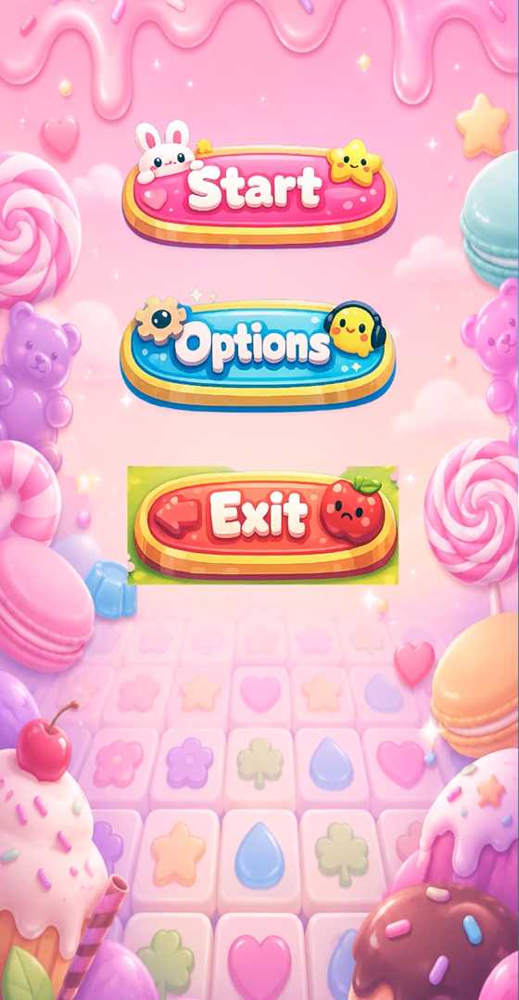
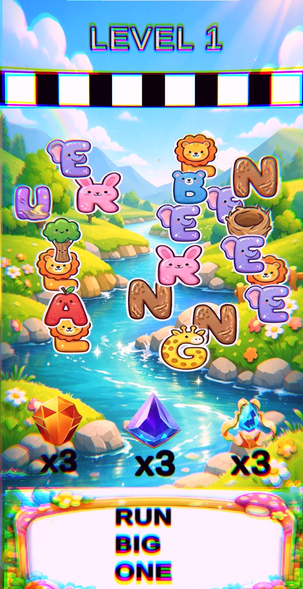
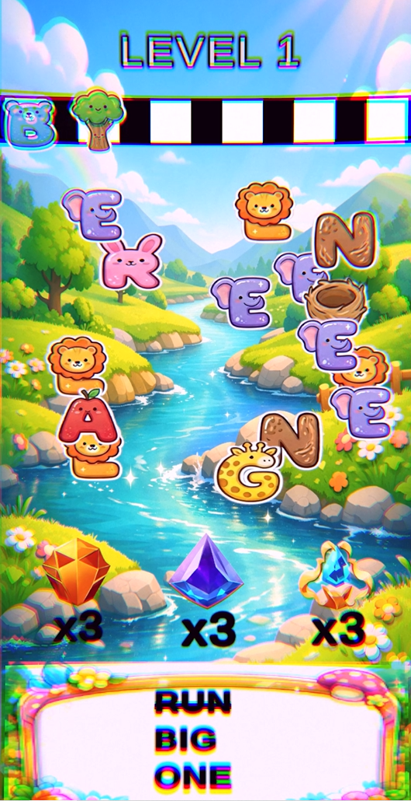
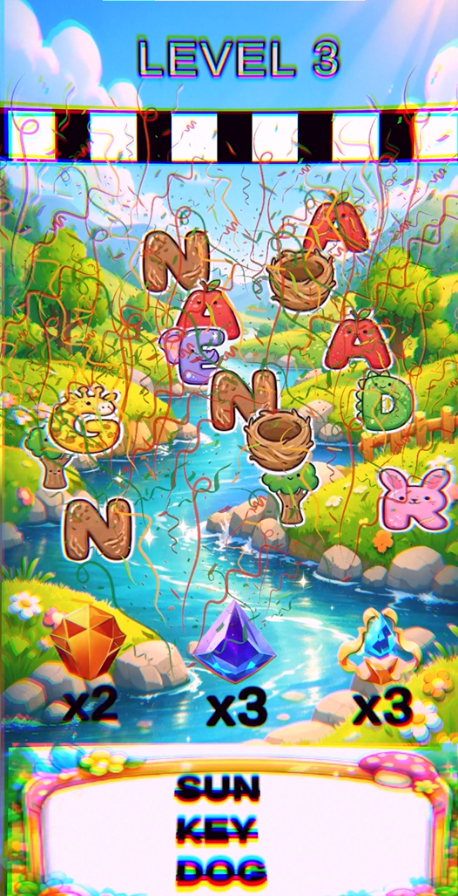
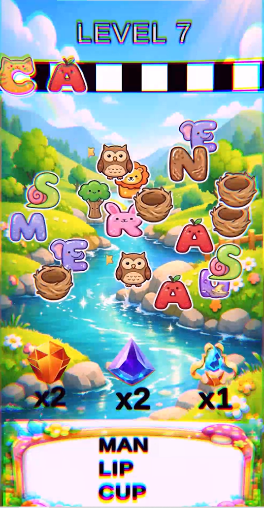

# 🅰️ Magic Tiles Letters 3D

**A 3D mobile word puzzle game** — drag letter tiles to spell hidden words.

---

## 🎯 Core Gameplay Loop

- Random letter tiles spawn on screen  
- Player taps tiles to place them into UI slots  
- Live word validation runs in real time  
- Matching words are detected inside the sequence  
- Matched letters burst, fade, and remaining letters shift left  
- Clear all 3 target words to complete the level  
- Fill slots incorrectly → game over  

---

## 🧠 Core Systems Overview

### 🔤 Word System (WordManager & WordData)

- Words stored as ScriptableObject assets  
- Filters valid words (3–6 letters, alphabet-only)  
- Each level selects 3 active words  
- Live substring matching via IndexOf  
- Completed words marked with strikethrough  
- Level ends when all target words are cleared  

---

### 🧩 Letter Spawning (LetterSpawner)

- Builds letter pool from target words + filler letters  
- Adds random padding letters for variation  
- Total spawn count ~20 letters per level  
- Minimum distance check prevents overlap  
- Prefab dictionary for fast lookup  

---

### 🖱️ Interaction (ClickableLetter)

- Tap-based tile selection  
- Smooth movement into slot positions  
- Lerp-based animation system  
- Triggers validation on placement  

---

### 🔍 Live Word Validation

- Current input rebuilt from slot order  
- Minimum 3-character validation  
- Substring search against active words  
- Matched letters removed dynamically  
- Remaining letters shift left automatically  

---

### 💥 VFX System

- Burst + fade animation on match  
- Optional particle effects  
- Win / lose feedback effects  
- Audio feedback for interactions and results  

---

### ⚡ Skills System

Three limited-use abilities:

- **Auto-Match** → clears a random valid word  
- **Undo** → removes last placed letter  
- **Hint Fill** → auto-solves a target word  

Skills are rewarded on level completion (max 3 per type).

---

## 📊 Progression System

- Level-based increasing difficulty  
- Random word selection per level  
- Skill rewards after completion  
- Scene reload on failure  
- Endless loop gameplay structure  

---

## ⚙️ Architecture

### 🧩 Design Patterns

- Singleton (central managers)  
- ScriptableObject (data-driven word system)  
- Event-driven communication  
- Modular gameplay components  

---

### 🧠 Performance Strategy

- No unnecessary per-frame allocations  
- Coroutine-based animations instead of Update loops  
- Dictionary-based prefab lookup  
- Lightweight GC-friendly design  

---

## 🛠️ Tech Stack

- Engine: Unity (3D, UI-driven gameplay)  
- Language: C#  
- UI: Unity UI (uGUI) + TextMeshPro  
- Architecture: Modular + ScriptableObject-based  
- Target Platform: Android  

---

## 📸 Screenshots

  
  
  

  
  

 

---

## 🎬 Gameplay Preview

  

---

## 🚀 Status

- Core gameplay loop complete  
- Live word detection system implemented  
- Letter spawning system complete  
- Skill system integrated (3 abilities)  
- VFX and audio feedback implemented  
- Level progression functional  
- Ready for polishing and balancing  

---

## 📂 Main Scripts

- WordManager  
- LevelManager  
- LetterSpawner  
- ClickableLetter  
- WordData  
- LetterMatchVFX  

---
